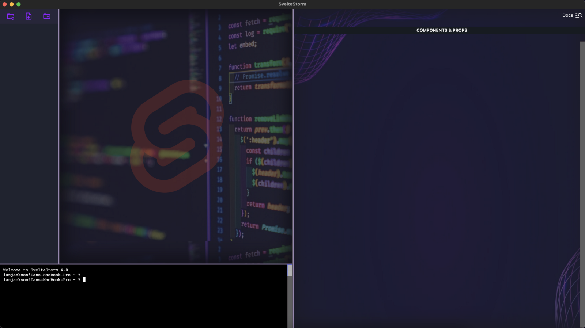

 <h1 align = center>
 
SvelteStorm 5.0
</h1>

## Table of Contents
 - [New Features and Improvements](#new-features-and-improvements)
 - [How To Use SvelteStorm](#how-to-use-sveltestorm)
 - [Installing SvelteStorm 5 for the Purpose of Enhancing SvelteStorm as an IDE](#installing-sveltestorm-5-for-the-purpose-of-enhancing-sveltestorm-as-an-ide)
   - [macOS](#macos)
   - [Windows (using WSL 2)](#windows)
 - [Key Features](#key-features)
 - [Authors](#authors)
 - [Previous Authors](#previous-authors)
 - [Contributing](#contributing)
   - [Project](#project)
   
## SvelteStorm
A Svelte IDE like no other. Embrace the storm.
SvelteStorm is an open-source integrated developer environment (IDE) specifically tailored to provide essential tools a Svelte developer needs to build a Svelte application. With the new and improved SvelteStorm 5.0, we've improved the developer experience with performance metrics, split view, search, and linting, in addition to the existing code editor, terminal environment, file directory, browser view, developer tools, and component state viewer. SvelteStorm is built using Svelte and Electron and is downloadable for Windows and Mac operating systems.
 
## New Features and Improvements
 
1. App Performance Metrics
2. Split View
3. Search
4. Linting
5. Quality of Life changes

## How To Use SvelteStorm
1. Click on the 'File' menu button in the top-left corner, then open a file or folder to begin editing. (You can also use CTRL+F to open a folder with a shortcut)
2. When a Svelte project is opened, you will notice the File Directory populates showing all files in the directory. From here you can open, edit, and save files.
3. To use the browser window, simply run any command to start your project and a new browser window will open to the localhost port your project is running on.
4. To search through your open files, CMD+F while in the editor window.
5. To gather App Performance metrics, start the application with the command 'npm run performanceSS' and click on the 'Performance Dash' button on the top right of the application to view the dashboard, then interact with the application - the dashboard will update automatically. Some of the web vitals will populate once the app is closed. Click 'back' at the bottom of the window to exit the dashboard. 
6. To enable Split View, click the 'Split View' button on the top right of the application. Click 'back' at the bottom of the window to exit the dashboard.
7. To use the Time Travel Debugging feature, run the command 'npm run sdebug' and a browser window will open with your project. Additionally, the Time Travel Debugging window will generate an initial snapshot of your project and a d3.js component hierarchy tree of your application. Any action on the browser window that creates a state change in your application will generate a new snapshot and update the d3.js tree. To view previous snapshots, click on the Snapshot button of your choice and you will see cards for each component that contain the component’s state at the time of the snapshot. As you navigate between Snapshots, you will notice your application state changes are reflected on your browser window. This will allow you to see how your applications state changes based on different events, happy debugging!
8. Developer Tools are accessible via the 'Help' button in the top menu, or by using CTRL+D
9. For more information, click on SvelteStorm's Website via the 'Help' button
for VSCode users the link below can provide insight to potential installation issues:
https://github.com/open-source-labs/SvelteStorm/issues/57

 
## Installing SvelteStorm 5 for the Purpose of Enhancing SvelteStorm as an IDE
 
### macOS
 
1. If using **Node Version Manager** (nvm) enter the following commands to help ensure a smooth installation:
  Install node version 16.16.0
     - `nvm install 16.16.0`
     - `nvm use 16.16.0`
     - `nvm alias default 16.16.0`
2. Clone this **SvelteStorm 5.0** repo to your code editor of choice (VS Code works best)
3. Run `npm install` to install dependencies
4. Run `npm start` and SvelteStorm will open up and be ready for use!
 

### Windows (**DO NOT USE WSL**)
#### Do Not attempt to use anything related to WSL!!
1. Install all of the latest Windows Updates (including the optional ones)
2. Install the latest PowerShell (version 7.2.5 as of this writing)
   -  [Link to PowerShell Installation](https://docs.microsoft.com/en-us/powershell/scripting/install/installing-powershell-on-windows?view=powershell-7.2)
3. Install Microsoft Visual Studio
  - Note: This **IS NOT** Visual Studio Code … Just plain Visual Studio
  - As of this writing 17.2.6
  - [Link to Visual Studio](https://visualstudio.microsoft.com/thank-you-downloading-visual-studio/?sku=Community&channel=Release&version=VS2022&source=VSLandingPage&cid=2030&passive=false)
  - When prompted for modules to include, select the following:
    - Python development
    - Node.js development
    - Desktop development with C++

4. Install **Node Version Manager** (nvm) for Windows
  - [Walkthru Available on GeeksforGeeks](https://www.geeksforgeeks.org/how-to-install-and-use-nvm-on-windows/)
  - Using `nvm` enter the following commands to install Nodejs version 16.16.0
     - `nvm install 16.16.0`
     - `nvm use 16.16.0`
5. Clone this repo to your code editor of choice (VS Code works best)
6. Run npm install to install dependencies
7. Run npm start and SvelteStorm will open up and be ready for use!
8. Install the latest version of git
   - [Git Installation Link](https://git-scm.com/download/win)
9. Now Install Visual Studio Code
  - [VS Code Installation Link](https://code.visualstudio.com/)
 
 
10. Install the following VS Code Extensions:
    1.  [Remote Development](https://marketplace.visualstudio.com/items?itemName=ms-vscode-remote.vscode-remote-extensionpack)
           - Remote WSL
           - Remote SSH
           - Remote Containers
      1.  [CMake Tools](https://marketplace.visualstudio.com/items?itemName=ms-vscode.cmake-tools)
      2.  [C/C++ Extension Pack](https://marketplace.visualstudio.com/items?itemName=ms-vscode.cpptools-extension-pack)
11. Clone this **SvelteStorm 5.0** repo to your code editor of choice (VS Code works best)
12. Run `npm install` to install dependencies
13. Run `npm start` and SvelteStorm will open up and be ready for use!

 
 
## Key Features
1. (NEW!) Performance Dashboard - gain insights into your Svelte application such as the number of times different components are rendered and web vitals.
2. (NEW!) File Search - search through open files in the code editor.
3. (NEW!) Split View - view two files at once.
4. (NEW!) Javascript and HTML Linting - quickly find and fix syntax errors and warnings.
5. Time Travel Debugging Dev Tool
6. Real Time d3.js Component Hierarchy Visualization
7. Upgraded Browser Window
8. Updated Terminal. Built using XTerm
9. Tooltips Bar on Mouse Hover
10. Access to Svelte Documentation with a Single Click
11. Responsive Window Resizing
12. Tab Management Functionality Added
13. A Clean & Bold Theme Style
14. A code editor utilizing the “Dracula” dark-mode theme with syntax highlighting and bracket pair identification. Built using Code Mirror.
15. A fully functional terminal environment to navigate file systems and run code
16. A browser window for developers to see what their projects look like on the client end
17. A functioning file directory where users can open files and navigate folders to edit within the code editor
## Authors
[Mahmoud Albadawi](https://github.com/CodeMahmoud) | [Kiran Banger](https://github.com/kiranbanger) | [Leilani Hernandez](https://github.com/lherna05) |
[Javi Orozco](https://github.com/jorozco94)  | 
## Previous Authors
[Jim White](https://github.com/HirsuteJim) | [Karen Cheung](https://www.github.com/karenc810) | [Elliott Burr](https://www.github.com/elliottburr) |
[Ryan Huie](https://www.github.com/8-ryan-8) | [Ian Jackson](https://github.com/irjackson) |
[Andy Jiang](https://github.com/realandygithub) | [Colton Robbins](https://www.github.com/coltonro) | [Ricky Johnson](https://www.github.com/JSJedi) |
[Zachary Radford](https://www.github.com/zachradf) | [Arron Nestor](https://github.com/NesTar6) | [Aye Moe](https://github.com/ayemmoe) |
[Frank Stepanski](https://github.com/frankstepanski) | [Kevin Sarchi](https://github.com/Svrchi) |
[Sam Filip](https://github.com/samfilip) | [Cayla Co](https://github.com/caycodes) | [Swetha Kunda](http://github.com/swethakunda) |
[Miller Johnston](https://github.com/MillerJ20) | [Sina Kahrobaei](https://github.com/Skaybee)
## Contributing
There are many ways in which you can participate in this project, for example:
- Check for known issues that you may be able to provide input on
- Submit bugs and feature requests, and help us verify as they are checked in
- Review source code changes
- Review the documentation and make pull requests for anything from typos to additional and new content
 
 
This application uses Open Source components. You can find the source code of their open source projects along with license information below. We acknowledge and are grateful to these developers for their contributions to open source.
 
### Project:
 
Delorean https://github.com/oslabs-beta/DeLorean\nCopyright (c) 2022 OSLabs Beta
 
License (MIT) https://github.com/oslabs-beta/DeLorean/blob/main/LICENSE'

